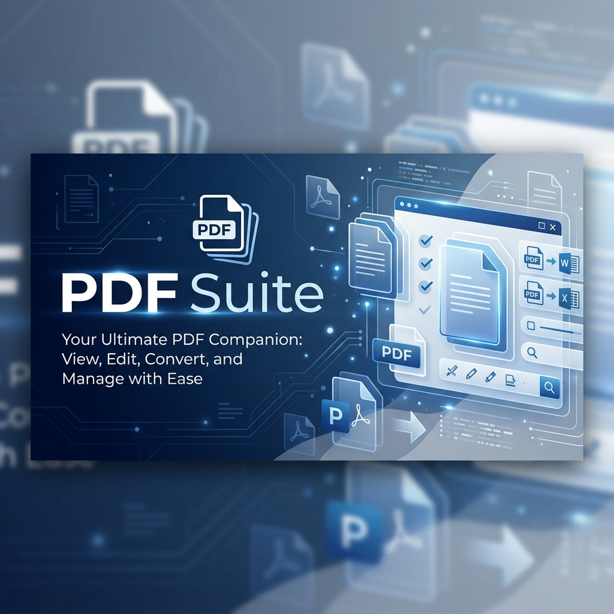

# PDF Suite 📄✨



A professional, high-performance desktop application for seamless PDF management. Convert documents, images, and text to high-quality PDFs, or merge multiple files into a single document with a clean, intuitive interface.

[](https://opensource.org/licenses/MIT)
[](https://www.python.org/)
[](https://www.riverbankcomputing.com/software/pyqt/)

---

## 🚀 Features

### 🔄 Multi-Format Conversion
- **Images to PDF**: Support for `JPG`, `PNG`, `BMP`, `GIF`, and `TIFF`.
- **Documents to PDF**: Convert Microsoft Word (`DOC`, `DOCX`) and `RTF` files (Windows only).
- **Text to PDF**: Transform plain text files into clean, readable PDF documents.
- **Batch Processing**: Convert dozens of files simultaneously with one click.

### 🧩 PDF Merging
- **Combine PDFs**: Merge multiple PDF files into a single document.
- **Drag & Drop Reordering**: Easily reorder files in the merge list to get the sequence just right.
- **Merge-on-Conversion**: Optionally merge all files being converted directly into a single output PDF.

### ⚙️ Advanced Controls
- **Quality Management**: Choose between lossless conversion (via `img2pdf`) or adjustable JPEG compression to optimize file size.
- **Smart Output**: Automatically save to the source directory or select a custom destination.
- **Post-Process Actions**: Option to automatically open the resulting file after conversion.
- **Overwrite Protection**: Safety toggle to prevent accidental file replacement.

---

## 🛠️ Installation

### Prerequisites
- **Python 3.8+**
- **Windows OS** (required for Microsoft Word conversion features)

### Setup

1. **Clone the repository:**
   ```bash
   git clone https://github.com/Satbir-Singh-42/PDF-Suite.git
   cd PDF-Suite
   ```

2. **Install dependencies:**
   ```bash
   pip install -r requirements.txt
   ```

3. **Run the application:**
   ```bash
   python pdf_converter.py
   ```

---

## 📖 Usage Guide

### 📂 Converting Files
1. Navigate to the **File Conversion** tab.
2. Click **Add Files** to select images, Word docs, or text files.
3. Choose your **Output Format** (PDF is default).
4. (Optional) Check **Merge into single PDF** if you want one combined output.
5. Click **Convert** and watch the magic happen!

### 🔗 Merging Existing PDFs
1. Navigate to the **PDF Merge** tab.
2. Click **Add PDFs** to select your files.
3. Use **Move Up** and **Move Down** to set the desired order.
4. Click **Select Output File** to name your new PDF.
5. Click **Merge PDFs**.

---

## 💻 Technology Stack

- **GUI Framework**: [PyQt5](https://www.riverbankcomputing.com/software/pyqt/)
- **PDF Generation**: [fpdf](http://pyfpdf.googlecode.com/), [img2pdf](https://gitlab.mister-muffin.de/josch/img2pdf)
- **PDF Manipulation**: [PyPDF2](https://pypi.org/project/PyPDF2/), [pikepdf](https://github.com/pikepdf/pikepdf)
- **Image Processing**: [Pillow (PIL)](https://python-pillow.org/)
- **Automation**: [pywin32](https://github.com/mhammond/pywin32) (for Word integration)

---

## 🤝 Contributing

Contributions are welcome! If you have suggestions for new features or improvements, feel free to open an issue or submit a pull request.

1. Fork the Project
2. Create your Feature Branch (`git checkout -b feature/AmazingFeature`)
3. Commit your Changes (`git commit -m 'Add some AmazingFeature'`)
4. Push to the Branch (`git push origin feature/AmazingFeature`)
5. Open a Pull Request

---

## 📜 License

Distributed under the MIT License. See `LICENSE` for more information.

---

<p align="center">
  Developed with ❤️ by <a href="https://github.com/Satbir-Singh-42">Satbir Singh</a>
</p>